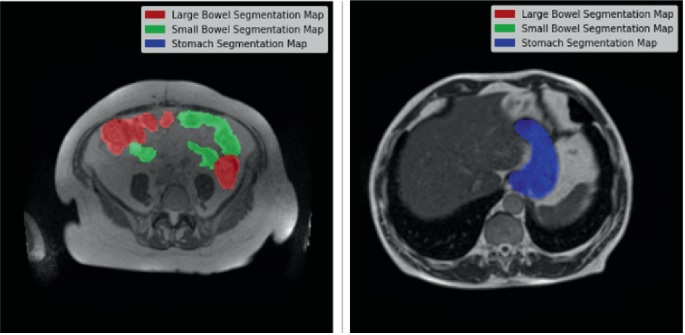
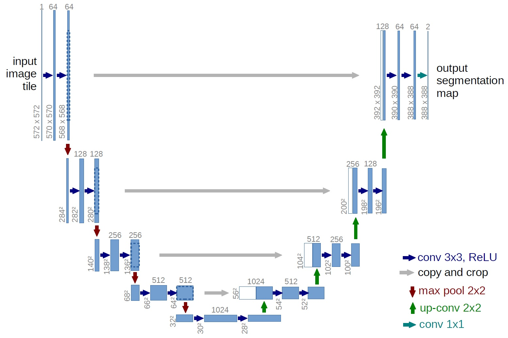
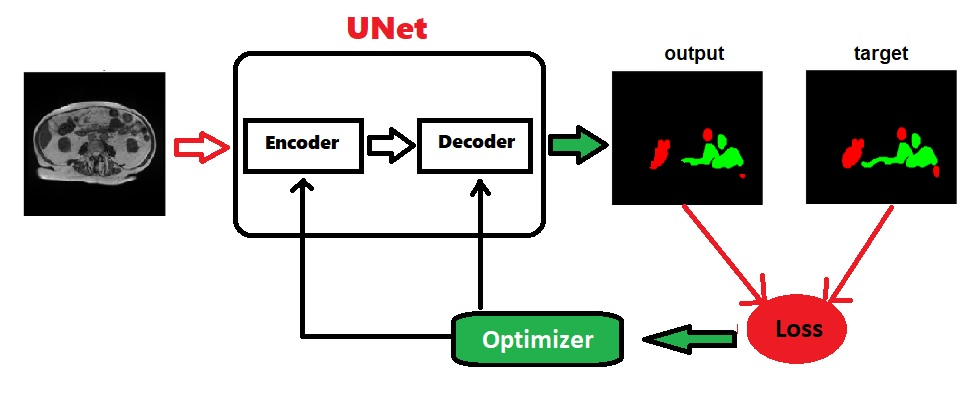

  

<h1 align="center">Medical Image Segmentation</h1>

This repository serves as the template for the third project in the Deep Catalyst course, focusing on medical image segmentation. Explore and utilize this template to kickstart your own medical image segmentation projects, leverage best practices, and accelerate your journey into the world of precise medical diagnostics through deep learning.

## 1. Problem Statement
Intestinal cancer, commonly referring to colorectal cancer (cancer of the colon or rectum), can be treated using various methods, including surgery, chemotherapy, and radiotherapy. Radiotherapy (or radiation therapy) is a common treatment modality for colorectal cancer, particularly rectal cancer. Radiotherapy involves the use of high-energy radiation to destroy cancer cells or inhibit their growth. Before starting treatment, a planning session (simulation) is conducted to precisely map out the treatment area using imaging techniques such as CT or MRI scans. Radiation oncologists try to deliver high doses of radiation using X-ray beams pointed to tumors in the treatment area while avoiding the stomach and intestines.  In these scans, radiation oncologists must manually outline the position of the stomach and intestines in order to adjust the direction of the x-ray beams to increase the dose delivery to the tumor and avoid the stomach and intestines. This is a time-consuming and labor intensive process that can prolong treatments from 15 minutes a day to an hour a day, which can be difficult for patients to tolerate.

 
    

New techniques, such as computer vision using deep learning models, can aid in the segmentation of tumors on MRI images. In this work, I trained a deep learning model to outline the position of the stomach and intestines in order to help radiation oncologists to perform their task faster which would allow more patients to get more effective treatment.

## 2. Related Works

This section explores and summarizing some notable methods of medical image segmentation using deep learning models from 2015 to 2021, along with their corresponding deep learning models and links to their papers or GitHub repositories.

| Date       | Title                                                                 | Description                                                                                                                | Links                                                                                                                                       |
|------------|-----------------------------------------------------------------------|----------------------------------------------------------------------------------------------------------------------------|---------------------------------------------------------------------------------------------------------------------------------------------|
| 2016    | U-Net: Convolutional Networks for Biomedical Image Segmentation        | U-Net is a convolutional network architecture for fast and precise segmentation of images.                                  | [Paper](https://arxiv.org/abs/1505.04597), [GitHub](https://github.com/zhixuhao/unet)                                                        |
| 2017    | V-Net: Fully Convolutional Neural Networks for Volumetric Medical Image Segmentation | V-Net is designed for volumetric image segmentation, specifically for 3D medical images.                                    | [Paper](https://arxiv.org/abs/1606.04797), [GitHub](https://github.com/faustomilletari/VNet)                            |
| 2018    | Attention U-Net: Learning Where to Look for the Pancreas               | Attention U-Net integrates attention mechanisms into U-Net for better segmentation performance.                            | [Paper](https://arxiv.org/abs/1804.03999), [GitHub](https://github.com/ozan-oktay/Attention-Gated-Networks)                                 |
| 2018    | Attention U-Net: Learning Where to Look for the Pancreas               | Attention U-Net integrates attention mechanisms into U-Net for better segmentation performance.                            | [Paper](https://arxiv.org/abs/1804.03999), [GitHub](https://github.com/ozan-oktay/Attention-Gated-Networks)                                 |
| 2020    | UNet++: A Nested U-Net Architecture for Medical Image Segmentation      | UNet++ proposes a nested U-Net structure for improved segmentation performance.                                             | [Paper](https://arxiv.org/abs/1807.10165), [GitHub](https://github.com/MrGiovanni/UNetPlusPlus)                                             |
| 2021    | TransUNet: Transformers Make Strong Encoders for Medical Image Segmentation | TransUNet leverages transformers as encoders and U-Net as decoders for improved medical image segmentation.                | [Paper](https://arxiv.org/abs/2102.04306), [GitHub](https://github.com/Beckschen/TransUNet)                                           |
| 2021    | UNETR: Transformers for 3D Medical Image Segmentation | UNETR introduces a transformer-based model for 3D medical image segmentation, achieving state-of-the-art performance.                | [Paper](https://arxiv.org/abs/2103.10504), [GitHub](https://github.com/Project-MONAI/research-contributions/tree/main/UNETR/BTCV)                    |
| 2023    | GI Track Image Segmentation with UNet and Mask R-CNN | Utilizes UNet and Mask R-CNN architectures for segmenting gastrointestinal tract images, enhancing diagnostic capabilities.                | [Paper](https://arxiv.org/pdf/2206.11048), [GitHub](https://github.com/praneeth200219/GI-Tract-Segmentation)                    |

## 3. The Proposed Method
U-Net is a convolutional network architecture designed for fast and precise segmentation of images. Initially proposed by Olaf Ronneberger, Philipp Fischer, and Thomas Brox in their 2015 paper "U-Net: Convolutional Networks for Biomedical Image Segmentation," it has become a standard model for image segmentation tasks, especially in the biomedical domain. U-Net has a symmetric U-shaped architecture, consisting of a contracting path (encoder) and an expansive path (decoder).

  

It includes skip connections between corresponding layers of the encoder and decoder, allowing the network to use fine-grained information from the encoder directly in the decoder. U-Net can work with very few training images and still achieve good performance through the use of extensive data augmentation. 

#### Applications
U-Net is widely used in various biomedical image segmentation tasks, such as:

- Organ Segmentation: Delineating organs in medical imaging modalities.
- Tumor Detection: Identifying and segmenting tumors in MRI or CT scans.
- Cell Tracking: Segmenting cells in microscopy images for biological research.

U-Net's combination of convolutional layers and symmetric architecture with skip connections has set a high standard in the field of medical image segmentation, making it a foundational model for further advancements.

  

For this project, as shown in the above figure, the model takes MRI scans from cancer patients as input image, then uses a UNet to obtain predicted segmented areas of patients MRI scans for "stomach", "larg bowel" and "small bowel". By employing the loss function, it compares the predicted mask to the true mask which we aim to minimize. The evaluation metric is Dice.

## 4. Implementation
This section delves into the practical aspects of the project's implementation.

### 4.1. Dataset
Under this subsection, you'll find information about the dataset used for the medical image segmentation task. It includes details about the dataset source, size, composition, preprocessing, and loading applied to it.
[Dataset](https://www.kaggle.com/competitions/uw-madison-gi-tract-image-segmentation/data)

##### UW-Madison GI Tract Image Segmentation Dataset

The UW-Madison GI Tract Image Segmentation dataset consists of multi-class segmentation masks for different parts of the gastrointestinal tract, such as the stomach, large intestine, and small intestine. The dataset includes images from various imaging modalities, with the aim of providing a comprehensive resource for training and evaluating segmentation algorithms in the medical domain.

The dataset contains segmentation masks for multiple classes within the GI tract, allowing for detailed analysis and segmentation of different anatomical regions. The segmentation masks are annotated by experts, ensuring high-quality and accurate labels for training and evaluation purposes.

#### Files
- train.csv - IDs and masks for all training objects.
- sample_submission.csv - a sample submission file in the correct format
- train - a folder of case/day folders, each containing slice images for a particular case on a given day.

Note that the image filenames include 4 numbers (ex. 276_276_1.63_1.63.png). These four numbers are slice width / height (integers in pixels) and width/height pixel spacing (floating points in mm). The first two defines the resolution of the slide. The last two record the physical size of each pixel.

#### Columns
- id - unique identifier for object
- class - the predicted class for the object
- segmentation - RLE-encoded pixels for the identified object

### 4.2. Model

We used UNet from a [Library](https://github.com/qubvel/segmentation_models.pytorch?tab=readme-ov-file#installation) in github.
Segmentation model is just a PyTorch nn.Module, which can be created as easy as:

!pip install segmentation-models-pytorch

import segmentation_models_pytorch as smp

model = smp.Unet(
    encoder_name="resnet34",        # choose encoder, e.g. mobilenet_v2 or efficientnet-b7
    encoder_weights="imagenet",     # use `imagenet` pre-trained weights for encoder initialization
    in_channels=1,                  # model input channels (1 for gray-scale images, 3 for RGB, etc.)
    classes=3,                      # model output channels (number of classes in your dataset)
)

### 4.3. Configurations
This part outlines the configuration settings used for training and evaluation. It includes information on hyperparameters, optimization algorithms, loss function, metric, and any other settings that are crucial to the model's performance.

#### loss_fn : 
        smp.losses.DiceLoss(mode='multilabel')
#### metric :
        Dice().to(device)
#### optimizer : 
        torch.optim.SGD(model.parameters(), lr=lr, momentum=0.9)

### 4.4. Train
Here, you'll find instructions and code related to the training of the segmentation model. This section covers the process of training the model on the provided dataset.

### 4.5. Evaluate
In the evaluation section, the methods and metrics used to assess the model's performance are detailed. It explains how the model's segmentation results are quantified and provides insights into the model's effectiveness.

