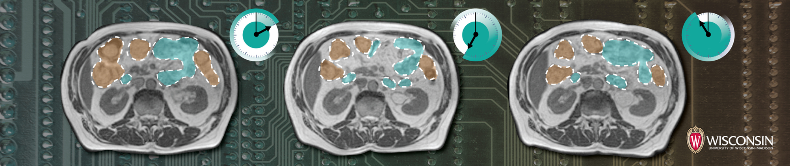
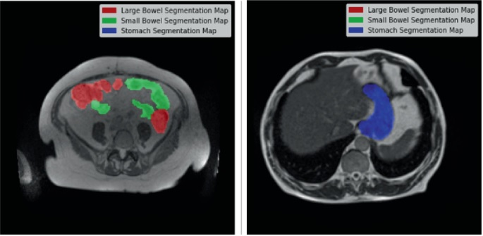

  

<h1 align="center">Medica Image Segmentation</h1>

This repository serves as the template for the third project in the Deep Catalyst course, focusing on medical image segmentation. Explore and utilize this template to kickstart your own medical image segmentation projects, leverage best practices, and accelerate your journey into the world of precise medical diagnostics through deep learning.

## 1. Problem Statement
Intestinal cancer, commonly referring to colorectal cancer (cancer of the colon or rectum), can be treated using various methods, including surgery, chemotherapy, and radiotherapy. Radiotherapy (or radiation therapy) is a common treatment modality for colorectal cancer, particularly rectal cancer. Radiotherapy involves the use of high-energy radiation to destroy cancer cells or inhibit their growth. Before starting treatment, a planning session (simulation) is conducted to precisely map out the treatment area using imaging techniques such as CT or MRI scans. Radiation oncologists try to deliver high doses of radiation using X-ray beams pointed to tumors in the treatment area while avoiding the stomach and intestines.  In these scans, radiation oncologists must manually outline the position of the stomach and intestines in order to adjust the direction of the x-ray beams to increase the dose delivery to the tumor and avoid the stomach and intestines. This is a time-consuming and labor intensive process that can prolong treatments from 15 minutes a day to an hour a day, which can be difficult for patients to tolerate.

 
    

New techniques, such as computer vision using deep learning models, can aid in the segmentation of tumors on MRI images. In this work, I trained a deep learning model to outline the position of the stomach and intestines in order to help radiation oncologists to perform their task faster which would allow more patients to get more effective treatment.

## 2. Related Works
This section explores existing research and solutions related to medical image segmentation. 

## 3. The Proposed Method
Here, the proposed approach for solving the problem is detailed. It covers the algorithms, techniques, or deep learning models to be applied, explaining how they address the problem and why they were chosen.

## 4. Implementation
This section delves into the practical aspects of the project's implementation.

### 4.1. Dataset
Under this subsection, you'll find information about the dataset used for the medical image segmentation task. It includes details about the dataset source, size, composition, preprocessing, and loading applied to it.
[Dataset](https://www.kaggle.com/competitions/uw-madison-gi-tract-image-segmentation/data)

### 4.2. Model
In this subsection, the architecture and specifics of the deep learning model employed for the segmentation task are presented. It describes the model's layers, components, libraries, and any modifications made to it.

### 4.3. Configurations
This part outlines the configuration settings used for training and evaluation. It includes information on hyperparameters, optimization algorithms, loss function, metric, and any other settings that are crucial to the model's performance.

### 4.4. Train
Here, you'll find instructions and code related to the training of the segmentation model. This section covers the process of training the model on the provided dataset.

### 4.5. Evaluate
In the evaluation section, the methods and metrics used to assess the model's performance are detailed. It explains how the model's segmentation results are quantified and provides insights into the model's effectiveness.

